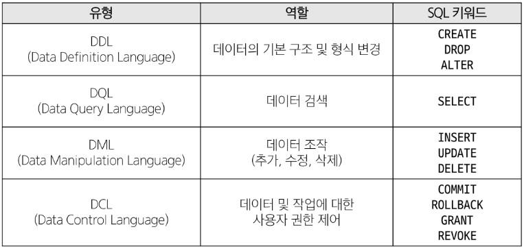
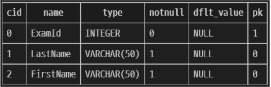
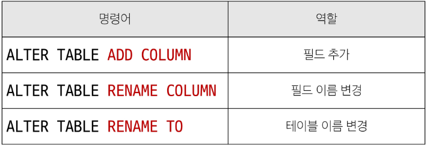

# 데이터베이스

#### 역할

: 데이터를 저장하고 조작

## Relational Database 관계형 데이터 베이스

#### 관계

여러 테이블 간의 논리적 연결

### def

- 테이블, 행, 열의 정보를 구조화하는 방식
- 서로 관련된 데이터 포인터를 저장하고 이에 대한 액세스를 제공

### KEYWORD

1. Table(=relation): 데이터를 기록하는 곳
2. Field(=Column, Attribute): 각 필드에는 고유한 데이터 형식이 지정됨
3. Record(=Row, Tuple): 각 레코드에는 구체적인 데이터 값이 저장됨
4. Database: 테이블의 집합
5. Primary Key(=PK): 각 레코드의 고유한 값
   - 관계형 db에서 레코드의 식별자로 활용
6. Foreign Key(=FK):
   - 테이블의 필드 중 다른 테이블의 레코드를 식별할 수 있는 키
   - 다른 테이블의 기본 키를 참조
   - 각 레코드에서 서로 다른 테이블 간의 관계를 만드는 데 사용

## RDBMS

: 관계형 데이터베이스를 관리하는 소프트웨어 프로그램

#### DBMS

: 데이터 베이스를 관리하는 소프트웨어 프로그램

- 데이터 저장 및 관리를 용이하게 하는 시스템
- db 와 사용자 간의 인터페이스 역할
- 사용자가 데이터 구성, 업뎃, 모니터링, 백업, 복구 등을 할 수 있도록 도움

---

# SQL

: db에 정보를 저장/ 처리 하는 프로그래밍 언어

- #### 테이블의 형태로 구조화된 관계형 데이터베이스에게 요청을 질의

## Syntax

```sql
SELECT column_name FROM table_name;
```

1. 키워드는 대소문자를 구분 X
   - but recommend to use Capital
2. statements 끝에 ';' 붙여야 함

- ### SQL statements의 4가지 유형

  

- ### 참고
  - Query: db로부터 정보를 요청 하는 것
  - 쿼리문: sql 로 작성하는 코드

## Querying data

- ### SELECT statement
  : 테이블에서 데이터를 조회
  - syntax:
    - SELECT 이후 데이터를 선택하려는 필드를 하나 이상 지정
    - FROM 키워드 이후 데이터를 선택하려는 테이블의 이름을 지정

### Comparison Operators 비교 연산자

### LIMIT clause

: 조회하는 레코드 수를 제한

# Managing Tables

## Create Table

```sql
CREATE TABLE table_name(
   column_1 data_type constraints,
   column_2 data_type constraints,
   ...,
);
```

- table_name 안에 필드 정의하고
- constraints => 제약조건
  - ex) NOT NULL

#### Example

```sql
CREATE TABLE examples(
   ExamID INTEGER PRIMARY KEY AUTOINCREMENT,
   LastName VARCHAR(50) NOT NULL,
   FIRSTNAME VARCHAR(50) NOT NULL
);
```

- examID 은 정수형이고 pk로 사용하며 자동증가한다
- VARCHAR => 문자열이며 50자
- NOT NULL 은 제약조건
  > 같은 이름의 table 이 존재한다면 error가 발생

### PRAGMA

: 테이블 구조 확인

```sql
PRAGMA table_info('examples');
```



### constraints

- primary key
  - 해당 필드를 기본 키로 지정
- NOT NULL
  - 해당 필드에 NULL값을 허용하지 않도록 지정
- FOREIGN KEY
  - 다른 테이블과의 외래 키 관계를 정의

### AUTOINCREMENT keyword

: 자동으로 고유한 정수 값을 생성하고 할당하는 필드 속성

- 특징
  - 필드의 자동 증가
  - 주로 primary key
  - INTEGER PRIMARY KEY AUTOINCREMENT 가 작성된 필드는 항상 새로운 레코드에 대해 이전 최대 값보다 큰 값을 할당
  - 삭제된 값은 무시되며 재사용 x

# Modifying table fields

## ALTER TABLE statement

: 테이블 및 필드 조작

- 역할
  

### 1. ALTER TABLE ADD COLUMN syntax

```sql
ALTER TABLE
   table_name
ADD COLUMN
   column_definition;
```

- ADD COLUMN 키워드 이후 추가하고자 하는 새 필드 이름과 데이터 타입 및 제약 조건 작성
  > 추가하고자 하는 필드에 NOT NULL제약조건이 있을 경우 NULL 이 아닌 기본 값 설정 필요

### 2. ALTER TABLE RENAME COLUMN syntax

```sql
AlTER TABLE
   table_name
RENAME COLUMN
   current_name TO new_name
```

- RENAME COLUMN 키워드 뒤에 이름을 바꾸려는 필드의 이름을 지저하고 TO 키워드 뒤에 새 이름을 지정

### 3. ALTER TABLE RENAME TO syntax

```sql
ALTER TABLE
   table_name
RENAME TO
   new_table_name;
```

- RENAME TO 키워드 뒤에 새로운 테이블 이름 지정

## DROP TABLE

: 테이블 삭제

```sql
DROP TABLE table_name;
```

## 참고

### 타입 선호도

: 컬럼에 데이터 타입이 명시적으로 지정되지 않았거나 지원하지 않을 때 SQLite 가 자동으로 데이터 타입을 추론하는 것

# DML

: 데이터 조작 (추가, 수정, 삭제)

- INSERT, UPDATE, DELETE

## Insert data

```sql
INSERT INTO table_name (c1, c2, ...)
VALUES (v1, v2)
```
