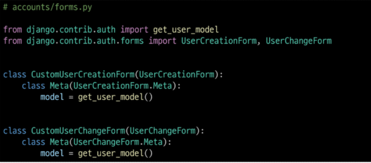

### `UserCreationForm()`

: 회원 가입시 사용자 입력 데이터를 받는 built-in ModelForm

- 바로 사용할 수 없는 이유는 usermodel을 custom 한 것이기 때문에
- user 커스텀하면 장고 기본 유저를 하는 것이 아님
- modle = User(장고 기본 유저) 에서 model이 바뀌고 유저 커스텀을 새롭게 등록해야 함

- AttributeError at /accounts/signup/ 이런한 오류 메세지
  - 유저모델 커스텀 -> 기존 기본 유저모델로 변경하면 됨

### 다시 작성해야 하는 FORM

- UserCreationForm
- UserChangeForm
  - 두 폼 모두 class Meta: model = User가 작성된 Form

### 1.



- Meta 로 부터 상속받아서 모델만 바꾸고 나머지는 유지

### `get_user_model()`

: '현재 프로젝트에서 활성화된 사용자 모델'을 반환하는 함수

### why not user_model()?

- get_user_model()을 사용해 user모델을 참조하면 커스텀user 모델을 자동으로 반환해주기 때문

## 회원 탈퇴

- AnonymousUser: 로그인 되지 않은 상태
- 로그인한 user 정보는 request.user에 들어있음
- anonymousUser 가 기본적으로 request.user 에 들어있어서 로그인 하면 자동적으로 삭제 됨

```python
def delete(request):
    if request = 'POST':
        request.user.delete()
        return reidrect('articles:index')
```

## 회원정보 수정

#### CustomUserChanbgeForm 사용할 때 조심할 점

- field 제한
- 유저 모델

### 로직

- model fields에서 tuple, list둘다 사용가능
- user 정보는 request.user 에 들어있다

### `upadate_session_auth_hash(request, user)`

: 암호 변경 시 세션 무효화를 막아주는 함수

- 암호가 변경되면 새로운 password의 Session data로

#### 비번 변경단계

- Password form
  - 1번째 인자 reqquest.user
- update_session_auth_hash
  - request
  - 바뀐 user 정보가지고 오고
  -
