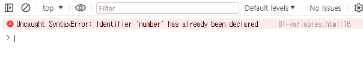
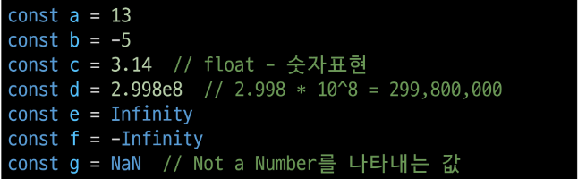
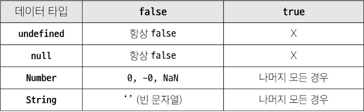
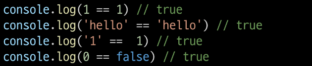

## 변수

- 반드시 문자, 달러, 밑줄로 시작
- 대소문자 구분
- 예약어 사용 불가
  - for, if, function
- 카멜 케이스
  - 변수, 객체, 함수에 사용
- 파스칼 케이스
  - 클래스, 생성자에 사용
- 대문자 스네이크 케이스

  - 상수에 사용

- 변수 선언 키워드
  - let, const, var

### 변수 선언 키워드

### 1. let

: 블록 스코프를 갖는 지역 변수를 선언

- block scope:
  - it, for, 함수 등의 중괄호 내부를 가리킴
  - 블록 스코프를 가지는 변수는 블록 바깥에서 접근 불가능
- 재할당 가능
- 재선언 불가능
- ES6에서 추가

```javascript
// let
let number = 10;
// 재할당 가능
number = 20;
// 재선언 불가능
let number = 100;
```

- 아래와 같은 오류 발생
  

### 2. const

: 블록 스코프를 갖는 지역 변수를 선언

- 재할당 불가능
- 재선언 불가능
- ES6에서 추가

```javascript
// const
const secondNumber = 10;
// 재할당 불가능
secondNumber = 20;
// 재선언 불가능
const secondNumber = 100;
```

#### let 과 const 의 다른점

```javascript
// let 은 초기값이 없어도 오류가 나지는 않지만
// undefined 를 출력한다
let number
console.log(number)
// const는 초기값이 없으면 오류가 난다
const thirdNumber
// 'const' declarations must be initialized.
```

#### 어떤 변수 선언 키워드를 사용?

- 기본적으로 const 사용 권장
- 재할당이 필요할 때 let으로 변경해서 사용
  > => 재할당은 되도록이면 하지말라는 뜻

## 데이터 타입

1. 원시 자료형
   : 변수에 값이 직접 저장되는 자료형
   - 불변
   - 값이 복사
   - Number, String, Boolean, null, undefined
1. 참조 자료형: 객체의 주소가 저장되는 자료형
   - 가변
   - 주소가 복사
   - Objects(Object, Array, Function)
     - Objects : oop에서의 객체
     - object: 데이터 타입

## 원시 자료형

- ### Number:
  - 정수 또는 실수형 숫자를 표현하는 자료형
    
- ### String:
  - 텍스트 데이터를 표현하는 자료형
  - '+' 연산자를 사용해 문자열끼리 결합
  - 뺄셈, 곱셈, 나눗셈 불가능
    - unlike python('HI'\*3 => 'HIHIHI)
- ### Template literals:

  - 내장된 표현식을 허용하는 문자열 작성 방식
  - Backtick(``)을 이용하며, 여러 줄에 걸쳐 문자열을 정의할 수도 있고 javascript의 변수를 문자열 안에 바로 연결할 수 있음
  - 표현식: '$'와 중괄호(${expression})로 표기
    

- ### null 과 undefined
  - null: 변수의 값이 없음을 의도적으로 표현할 때 사용
  - undefined: 변수 선언 이후 직접 값을 할당하지 않으면 자동으로 할당됨
- ### Boolean:
  - 조건문 또는 반복문에서 boolean이 아닌 데이터 타입은 자동 형변환 규칙에 따라서 true 또는 false로 변환됨
  - true / false
    - 유의할점: 대문자가 아닌 소문자임
  - 
- ### 할당 연산자
- ### 증가&감소 연산자

```javascript
// "전위 연산자"
// 피연산자에 1을 더한 값을 반환
// a에 4를 할당한 후 4를 반환
let a = 3;
const b = ++a;
console.log(a, b); // 4 4

// "후위 연산자"
// 피연산자에 1을 더하기 전의 값을 반환
// 3을 먼저 반환한 후 x에 4를 할당
let x = 3;
const y = x++;
console.log(x, y); // 4 3-
```

- ### 비교 연산자

  - #### 동등 연산자 (==)
    
  - #### 일치 연산자(===)
    
    > 특수한 경우를 제외하고는 일치 연산자 사용 권장

- ### 논리 연산자
  - and: &&
  - or: ||
  - not: !
  - 단축평가지원

## 반복문

- while
- for
- for..in
- for..of
