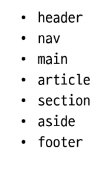

# Bootstrap
: 미리 만들어진 요소들 
- https://getbootstrap.com/docs/5.3/getting-started/introduction/
### :)
- 빠른 개발과 유지보수
- 손쉬운 반응형 웹 디자인
- 커스터마이징 용이
- 크로스 브라우징 지원
### :(
- 떨어지는 자유도
- 
## CDN (content delivery netweork)
: 지리적 제약 없이 빠르고 안전하게 콘텐츠를 전송할 수 있는 전송 기술
### 특징
- 웹 페이지 로드 속도 up
- 지리적으로 사용자와 가까운 CDN 서버에 콘텐츠를 저장해서 사용자에게 전달
## 기본 사용법
### 클래스 이름으로 spacing표현

- ex) mt-5
- https://getbootstrap.com/docs/4.0/utilities/spacing/
```
bootstrap에는 특정한 규칙이 있는 클래스 이름으로 스타일 및 레이아웃이 미리 설정되어 있음
```
## Reset CSS
: 모든 HTML 요소 스타일을 일관된 기준으로 재설정하는 간결하고 압축된 규칙 세트
- HTML Element, Table, List등의 요소들에 일관성 있게 스타일을 적용 시키는 기본 단계

### 사용 배경
- 모든 브라우저는 자신만의 스타일이 내장 되어 있기 때문에 모두 리셋해서 스타일 개발을 시작하기 위해서 
- User-agent sylesheets: 모든 문서에 기본 스타일을 제공하는 기본 스타일 시트

- bootstrap-reboot.css : 초기화 하는 코드 

## 활용
## Typography
## Component

#### modal id 값과 버튼의 data-bs-target이 각각 올바르게 일치하는지 확인
- 주의사항
    1. modal 코드와 button코드가 반드시 함께 다닐 필요는 없다
    2. modal 코드가 다른 코드 안쪽에 중첩되어 들어가버리면 modal이 켜졌을 때 회색 화면 뒤로 감쳐질 수 있음
    3. modal코드는 주로 body 태그가 닫히는 곳에 모아두는 것을 권장

# Semantic Web
: 웹 데이터를 의미론적으로 구조화된 형태로 표현하는 방식
## HTML Semantic Element
: 기본적인 모양과 기능 이외에 의미를 가지는 HTML 요소
- 검색엔진 및 개발자가 웹 페이지 콘텐츠를 이해하기 쉽도록 한다
## 대표적인 Sematic Element


# CSS 방법론
## OOCSS
: 객체 지향적 접근법을 적용하여 CSS 를 구성하는 방법론
### 기본 원칙
1. 구조와 스킨 분리
: 모든 버튼의 공통 구조를 정의 + 각각의 스킨을 정의 
2. 컨테이너와 콘텐츠 분리

