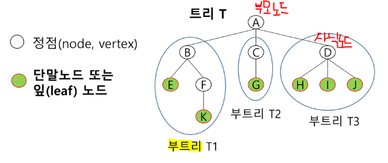
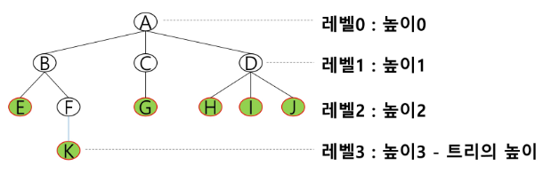
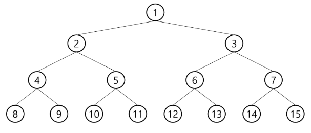
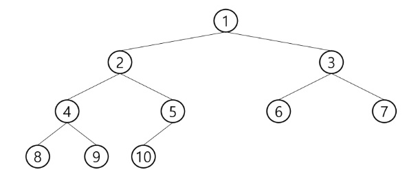
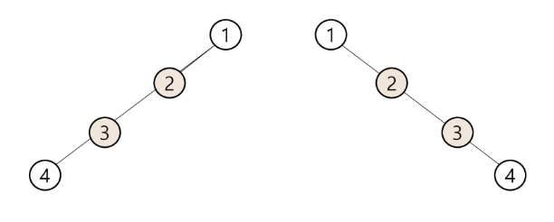
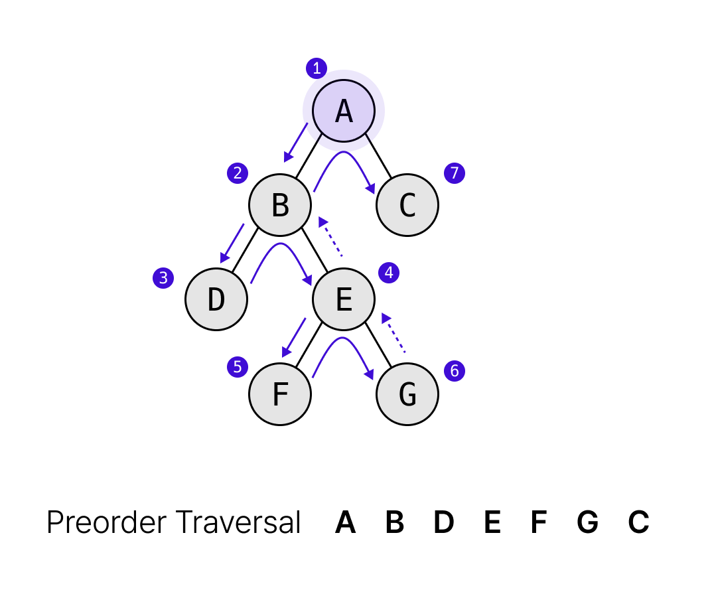
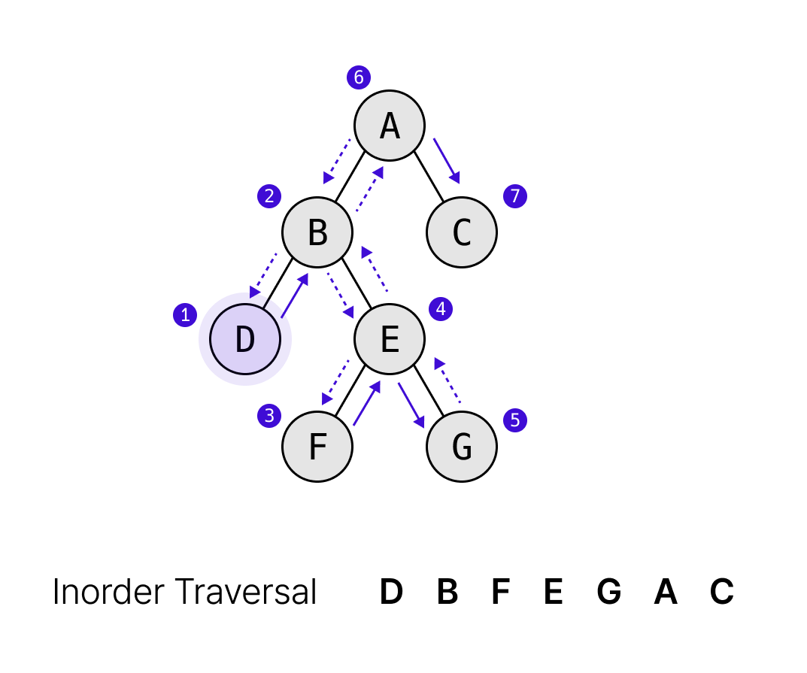
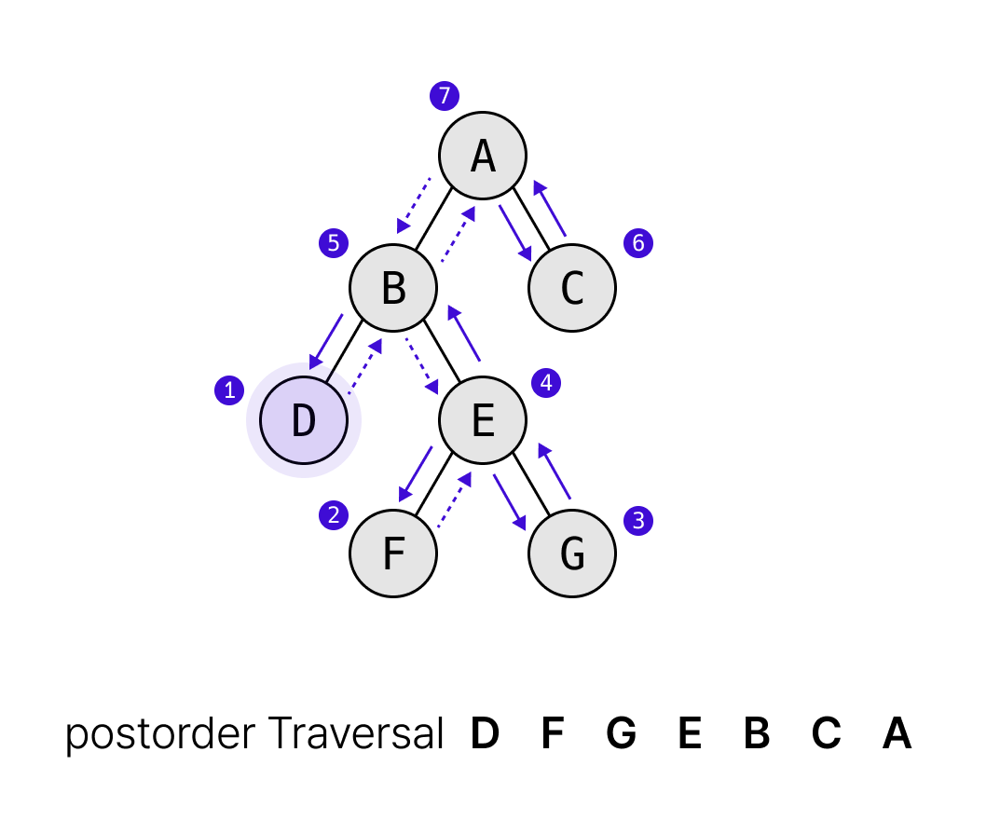

# 트리
: 한 개 이상의 노드로 이루어진 유한 집합이며 다음 조건을 만족한다


- 간선: 노드를 연결하는 선
    - 부모노드 --연결-- 자식노드
- 노드: 트리의 원소 
    - 루트노드: 트리의 시작노드
    - 형제 노드
    - 조상 노드:
        - K의 조상 노드: F B A
    - 자손 노드
- 서브 트리: 

- 차수(degree)
    - 노드의 차수: 노드에 연결된 자식 노드의 수 
        - B의 차수 = 2, C의 차수 = 1
    - 트리의 차수: 트리에 있는 노드의 차수 중에서 가장 큰 값
        - 트리 T의 차수 = 3
    - 단말 노드(리프노드) : 차수가 0인 노드 = 자식 노드가 없는 노드 


- 높이
    - 노드의 높이: 루트에서 노드에 이르는 간선의 수 (노드의 레벨)
    - 트리의 높이: 트리에 있는 노드의 높이 중에서 가장 큰 값 (최대 레벨)
        - 트리의 높이 = 3
    - 레벨이 1부터 시작하는 경우도 있다

# 이진트리
## 정의
: 모든 노드들이 **2개**의 서브트리를 갖는 특별한 형태의 트리
- _**각 노드가 자식 노드를 최대 2개까지만 가질 수 있는 트리**_
    - 왼쪽 자식 노드 left child node
    - 오른쪽 자식 노드 right child node
```
자식의 수만 두고 이진 트리라고 하는 것 노드의 개수와 헷갈리지 말기
```
## 특성
- 레벨 i에서의 노드의 최대 개수는 2^i 개
- 높이가 h인 이진 트리가 가질 수 있는 노드의 **최소 개수**는 **(h+1)** 개가 되며, **최대 개수** 는 **(2^(h+1)-1)** 개

## 종류
### 포화 이진 트리 Full Binary Tree

1. 모든레벨의 노드가 포화상태로 차 있는 이진 트리
- 높이가 h 일 때, 최대의 노드 개수인(2^(h+1)-1)의 노드를 가진 이진 트리
2.  루트를 1번으로 하여 (2^(h+1)-1)까지 정해진 위치에 대한 노드 번호를 가짐 
```
포화 이진트리라고 보기 위해선 위 조건 두개를 만족해야한다
```
### 완전 이진 트리 

: 높이가 h 이고 노드 수가 n개일 때, 포화 이진 트리의 노드 번호 1번부터 n 번까지 빈 자리가 없는 이진 트리
- 왼쪽부터 채워진 트리 

### 편향 이진 트리 

: 높이 h 에 대한 최소 개수의 노드를 가지면서 한쪽 방향의 자식 노드만을 가짐
- 왼쪽 편향
- 오른쪽 편향

## 순회
: 트리의 노드들을 체계적으로 방문하는 것
#### 순회방법
### 1. 전위순회:

- **부모노드** -> 좌 자식노드 -> 우 자식노드
```python 
def preorder_traverse(T): # 인자 T는 방문노드
    if T: # 노드가 비어있다면 그냥 return 
        visit(T)
        preorder_traverse(T.left)
        preorder_traverse(T.right)
```
### 2. 중위순회: 

- 좌 자식노드 -> **부모노드** -> 오른쪽 자식노드
- 노드를 기준으로 작은건 왼쪽 큰건 오른쪽으로 (**정렬된 방식** 으로 탐색 가능)
### 3. 후위 순회: 

- 좌 자식노드 -> 우 자식노드 -> **부모노드**
```
부모를 언제 탐색하냐에 따라서 순회방법의 이름이 다르다 
```
### 전위 순회

### 중위 순회
```python

```
### 후위순회 

## 이진트리의 표현 
### 배열을 이용 
when 완전/포화 이진트리라는 것을 알때
- 노드 번호를 인덱스로 쓰고 인덱스 1부터 시작하는 리스트 형식으로 넣는다
#### 노드 번호의 성질
ex) 노드 번호가 i
1. 부모노드 번호 i//2
2. 왼쪽 자식 노드 번호 2*i ( 부모노드에 곱하는것 )
3. 오른쪽 자식 노드 번호 2*i + 1
4. 레벨 n의 노드 번호 시작 번호 2^n
- 단점: 공간 낭비
        - 트리의 중간에 새로운 노드를 삽입하거나 기존의 노드를 삭제할 경우 배열의 크기 변경 어려워서 비효율적임

### 부모 번호를 인덱스로 자식 번호를 저장 
- - 부모번호가 index 이고 자식을 값으로 갖는 형태
- [[0,0], [2,0],...] -> [[왼쪽자식index, 오른쪽자식 index]]


### 루트 찾기, 조상찾기
- 자식이 index이고 부모를 값으로 갖는 형태 
- 부모가 없는 노드가 루트임 무조건 1, 0이 아님
- 단점: 왼쪽/오른쪽 자식 구분 할 수 없음 


## 연습문제
```python
def pre_order(T):
    if T: 
        print(T, end = ' ')
        pre_order(left[T])
        pre_order(right[T])


N = int(input())  # 1번부터 N번까지인 간선
E = N-1
arr = list(map(int, input().split()))
left = [0]*(N+1)  # 부모를 인덱스로 왼쪽자식번호 저장
right = [0]*(N+1) 
par = [0] * (N+1)  # 자식을 인덱스로 부모 저장

for i in range(E):
    p, c = arr[i*2], arr[i*2+1]
# for i in range(0, E*2, 2):
#     p, c = arr[i], arr[i+1]
    if left[p] == 0:   # 왼쪽 자식이 없으면
        left[p] = c
    else: 
        right[p] = c
    par[c] = p

c = N
while par[c] !=0 : # 부모가 있으면
    c = par[c]  # 부모를 새로운 자식으로 두고 
root = c   # 더 이상 부모가 없으면 루트 
print(root)
pre_order(root)

```