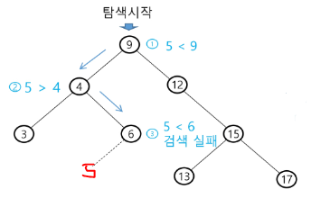
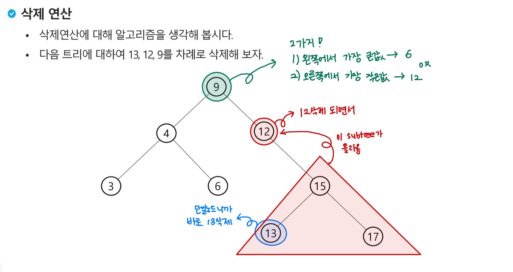
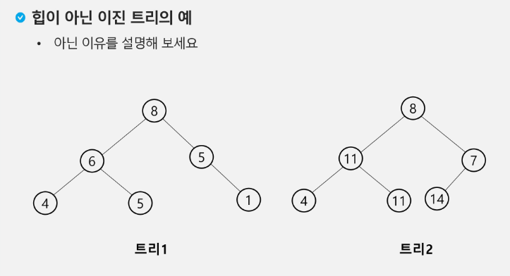
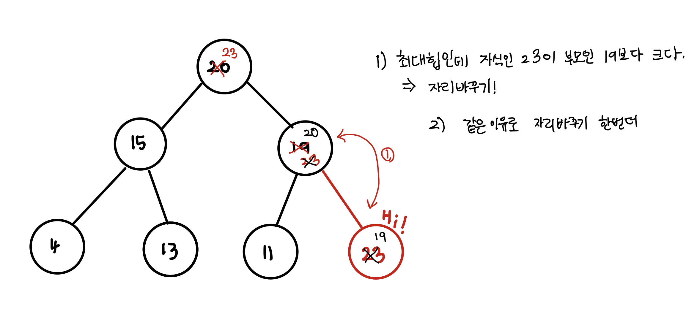
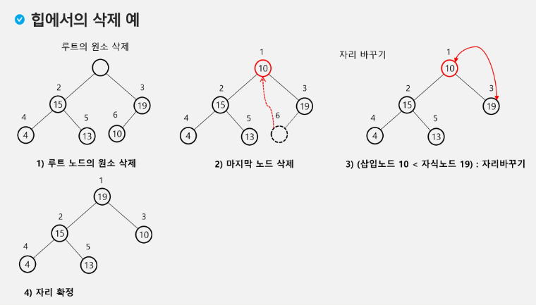

#### 흔한 선입견
- 루트가 모두 1 인 것은 아님
- 부모노드가 항상 자식 노드보다 큰것은 아님

# 이진탐색 트리 
- 모든 원소는 서로 다른 유일한 키를 갖는다 
- 루트를 기준으로 왼쪽: 루트보다 작은 값
     - 오른쪽: 루트보다 큰 값
- 중위 순회하면 오름차순으로 정렬된 값 얻을 수 있음

-  완전 이진 트리 또는 균형트리로 바꿀 있다면 편향트리같은 최악의 경우를 없앨 수 있다
## 연산
### 탐색 
](image/search_13.png)

### 삽입

1. 가장 먼저 탐색 연산을 수행해서 원소가 있는지 없는지를 확인해줘야됨
    - 탐색에 성공: 삽입 X (중복)
    - 탐색에 실패: 삽입(중복 X)
2. 탐색 실패한 위치에 원소를 삽입

### 삭제 

https://velog.io/@seochan99/%EC%9E%90%EB%A3%8C%EA%B5%AC%EC%A1%B0-%ED%83%90%EC%83%89Search-1-%EC%9D%B4%EC%A7%84-%ED%83%90%EC%83%89-%ED%8A%B8%EB%A6%AC-11-2-3-%EC%82%AD%EC%A0%9C-1


# 힙 heap
: 완전 이진 트리에 있는 노드 중에서 키값이 가장 큰 노드나 키값이 가장 작은 노드를 찾기 위해서 만든 자료구조
- 최대 힙
    - 루트 노드: 키값이 가장 큼
    - 부모 > 자식
- 최소 힙
    - 루트 노드 : 키값이 가장 작음
    - 부모 < 자식


- 트리 1) 완전 이진 트리가 아님
- 트리 2) 중복값이 있고 부모노드 8이 7보다 크고 11보다 작음으로 최대힙도 아니고 최소힙도 아니다 

## 연산
### 23 삽입하기

- 삽입은 마지막 노드 만 더할 수 있다 

### 삭제하기
- 루트 노드의 원소만을 삭제할 수 있다
- 루트 노드의 원소를 삭제하여 반환한다
- 힙의 종류에 따라 최대값 또는 최소값을 구할 수 있다


## Heap vs. BST
- Heap : 최대나 최소가 루트에 있고/ 완전 이진트리 형태를 유지해야 한다 
- BST : 더 자유로운 트리구조

## 구현해보자
### 최대힙 구하기
```python 
def enq(n):
    # 마지막 노드 추가(완전이진트리 유지)
    global last
    last += 1   # 마지막 노드 추가(완전이진트리 유지)
    h[last] = n # 마지막 노드에 데이터 삽입
    c = last # 부모>자식 
    p = c//2 # 부모번호 계산
    while p >= 1 and h[p]<h[c]: # 부모가 있는데, 더 작으면
        h[p], h[c] = h[c], h[p] # 교환
        c = p
        p = c//2    

N = 10  # 필요한 노드 수 
h = [0] * (N+1) 
last = 0
```
### 삭제하기
```python
# 최대힙
def enq(n):
    global last
    last += 1   # 마지막 노드를 추가(완전이진트리 유지)
    h[last] = n # 마지막 노드에 데이터(키값) 삽입
    c = last    # 부모 > 자식 비교를 위해
    p = c // 2  # 부모 번호 계산
    while p >= 1 and h[p] < h[c]:   # 부모가 있는데, 더 작으면
        h[p], h[c] = h[c], h[p]     # 교환
        c = p
        p = c // 2

def deq():
    global last
    tmp = h[1]   # 루트 노드의 키값 보관
    h[1] = h[last]
    last -= 1
    p = 1           # 새로 옮긴 루트
    c = p * 2
    while c <= last:    # 자식이 있으면
        if c+1 <= last and h[c] < h[c+1]: # 오른쪽자식이 있고 더 크면
            c += 1
        if h[p] < h[c]:
            h[p], h[c] = h[c], h[p]
            p = c
            c = p*2
        else:
            break
    return tmp

N = 10          # 필요한 노드 수
h = [0] * (N+1) # 최대힙
last = 0        # 힙의 마지막 노드 번호

enq(2)
enq(5)
enq(3)
enq(6)
enq(4)
while(last>0):
    print(deq())
```

