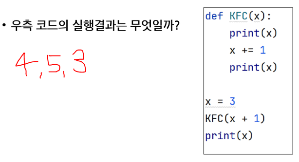

### 반복 vs. 재귀
- 반복은 수행하는 작업이 완료 될때까지 반복
- 재귀는 주어진 문제의 해를 구하기 위해 동일하면서 더 작은 문제의 해를 이용하는 방법

### 함수의 특징
1. KFC 함수 호출 -> **값만 복사**


2. 함수가 끝나면, Main으로 되돌아 오는 것이아니라, **해당 함수를 호출했던 곳으로 돌아옴**


## 재귀함수
- 기저조건``base case``: 무한 재귀호출을 막는 것 
    - 가지치기와 다름 *유의 
    - 기저조건이 없다면 recursion error가 발생
> 0 1 2 3 4 5 5 4 3 2 1 0 을 재귀호출을 이용하여 구현한다.( 몇번 Depth에서 return을 해야하고, print문을 어느 위치에 배치할지 고민해보자)
```python
# 기저조건: x == 6일 때 return

def KFC(x):
    if x == 6:
        return

    print(x, end ='')
    KFC(x + 1)
    print(x, end ='')

KFC(0)
```

- 스택형태로 나타내기 

### 트리형태
- 함수는 트리가 아니라 트리형태이다 

```python 
# def KFC(x):
#     if x == 3:
#         return
#     KFC(x + 1)
#     KFC(x + 1)
#     print(x, end = '')


def KFC(x):
    if x == 3:
        return
    for i in range(2):
        KFC(x+1)
run(0)
```

# 순열 
: 서로 다른 N개에서, R개를 중복없이, ``순서``를 고려하여 나열하는 것
- ``중복순열`` : 서로 다른 N개에서 R개를 중복을 허용하고, 순서를 고려하여 나열하는 것
## 중복순열 구현 원리
1. 재귀호출을 할 때마다, 이동 경로를 ``흔적``으로 남긴다.
    > 흔적 리스트: path => 저장용
2. **가장 마지막 레벨**에 도착했을 때, 이동 경로를 출력

### 코드로 자세하게 구현원리 설명
1) path라는 전역 리스트를 준비 
    ```python
    path = []
    ```
2) 레벨의 개수, 브랜치 개수로 동작되는 재귀 코드 구현 
    ```python 
    path = []
    def KFC(x):
        if x == 2:  # 레벨의 개수 
            return 

        for i in range(3):  # 브랜치 개수
            KFC(x+1)
    KFC(0)
    ```
3) 재귀호출을 하기 직전에 이동할 곳을 path에 저장
    ```python 
    path = []
    def KFC(x):
        if x == 2:  # 레벨의 개수 
            return 

        for i in range(3):  # 브랜치 개수
            path.append(i)
            KFC(x+1)
            
    KFC(0)
    ```
2) 재귀 호출 되었다. 
3) 다시 path.append(i)를 수행

```python
path = []

def kfc(x):
    if x == 3:
        print(path)
        return
    for i in range(1, 7):
        path.append(i)
        kfc(x+1)
        path.pop()
kfc(0)
```

## 중복을 취급하지 않는 순열 구현 방법
1. 중복순열 코드를 작성
2. 중복을 제거하는 코드를 추가

### 중복 제거 예시 
: 0을 선택하고 재귀호출 한 후에는, 또 다시 0을 선택하지 못하도록 막기
- 재귀 호출을 하기 직전, 이미 선택했던 숫자인지 아닌지 검사하는 코드가 필요 => continue
### 이미 사용한 숫자인지 구분하는 코드 
중복 순열과 순열 구현하기 
> N개의 주사위를 던져 나올 수 있는 모든 중복순열(Type1)과 순열(Type2)을 출력하시오 
```python 
path = []
used = []
N = 0

## 중복순열함수
def type1(x):
    if x == N:
        print(path)
        return
    for i in range(1, 7):
        path.append(i)
        type1(x+1)
        path.pop()

##순열함수 
def type2(x):
    if x == N:
        print(path)
        return
    for i in range(1, 7):
        if used[i] == True : continue
        used[i] = True
        path.append(i)
        type2(x+1)
        path.pop()

used = [False for _ in range(7)]
N, type = map(int, input().split())

if type == 1:
    type1(0)
if type == 2:
    type2(0)
```
# !!!완전탐색!!! Brute-Force
: 모든 가능한 경우의 수를 탐색 
> 문제1. 주사위 눈금의 합 


## 구현 예시
```python
# 중복순열 
def perm1(i, r): # i: 뽑는 순번, r: 뽑으려는 총 개수
    if i >= r:  # 뽑는 순번이 총 개수와 같거나 커지면 더이상 뽑지 않도록 base case설정
        print(*choice)
        return
    
    else:
        for j in range(i, len(card)):
            choice[i] = card[j]  # append
            perm(i+1, r)
            choice[i] = 0  # pop

# 순열
def perm2(i, r):
    if i >= r: 
        print(*choice)
        return
    
    else:
        for j in range(i, len(card)):
            if used[j] == 0:  # 만약 카드가 사용되지 않았다면
                used[j] = 1 # 사용처리 
                choice[i] = card[j] # 선택 카드에 추가
                perm2(i+1, r)
                choice[i] = 0 # 선택 카드에서 제외
                used[i] = 0  # 미사용 처리 

# 원본 수정
def perm3(i, r):
    if i >= r:
        print(card)
        return
    else:
        for j in range(i, len(card)):
            card[i], card[j] = card[j], card[i]
            perm3(i+1, r)
            card[i], card[j] = card[j], card[i]

card = ['A', 'B', 'C']
r = 2   # r: 뽑으려는 개수
choice = [0] * r

perm(0, r)
print('---'*10)

used = [0] * len(card)
perm2(0, r)
print('---'*10)

perm3(0, r)
```
