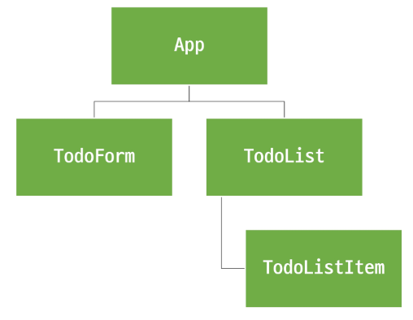

# state management
## 컴포넌트 구조의 단순화
- 상태 (state)
    - 앱 구동에 필요한 기본 데이터

# pinia
## 구성요소
1. Store
- 중앙 저장소 
- 모든 컴포넌트가 공유하는 상태, 기능 등이 작성됨
- defineStore()의 반환 값의 이름 => use 와 store 사용 권장
- defineStore()의 첫번째 인자는 애플리케이션 전체에 사용하는 store 의 고유 ID
2. State
- 반응형 상태 (데이터)
- ref() === state 
3. getters 
- 계산된 값
- computed() === getters
4. actions
- 메서드
- function() === actions
5. plugin 
- 애플리케이션의 상태 관리에 필요한 추가 기능을 제공하거나 확장하는 도구나 모듈
- 애플리케이션의 상태 관리를 더욱 간편하고 유연하게 만들어주며 패키지 매니저로 설치 이후 별도 설정을 통해 추가 됨

```
- 이러한 구성요소들을 사용하기 위해서는 return을 통해서 반환해야함
- store 에서는 공유하지 않는 private 한 상태 속성을 가지지 않음
- 여러개의 저장소를 가질 수 있음
```
## 구성요소 활용
### state
- 계층 구조에 상관없이 저장소에 바로 참조하여 수정/ 사용 가능
- 만약 store 에 state를 정의하지 않았다면 컴포넌트에서 새로 추가 X
### getters
- store 의 모든 getters 또한 state 처럼 직접 접근 가능
### actions
- store 의 모든 actions또한 직접 접근 및 호출할 수 있음
- getterse 와 달리 state조작., 비동기, api 호출이나 다른 로직 진행 가능

```html
<template>
  <div>
    <p>{{ newNumber }}</p>
    <p>{{ store.count }}</p>
    <p>{{ store.doubleCount }}</p>
    <button @click="store.increment()">yup</button>
  </div>
</template>

<script setup>
// counter.js 가 바자 스크립트 파일이라서 .js 는 생략가능
import { useCounterStore } from '@/stores/counter'

// 인스턴스 생성
const store = useCounterStore()
// 객체.메서드 

//state
console.log(store.count)
const newNumber = store.count + 1
//getters
console.log(store.doubleCount)

</script>

<style scoped>

</style>
```

# 실습 가자고오
- Todo CRUD 구현
- Todo 개수 계산
    - 완료된 Todo 개수
- component 구성


## 사전 준비사항


## local storage 특징

$ npm i pinia-plugin-persistedstate