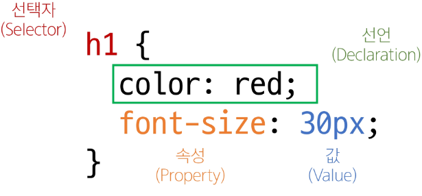
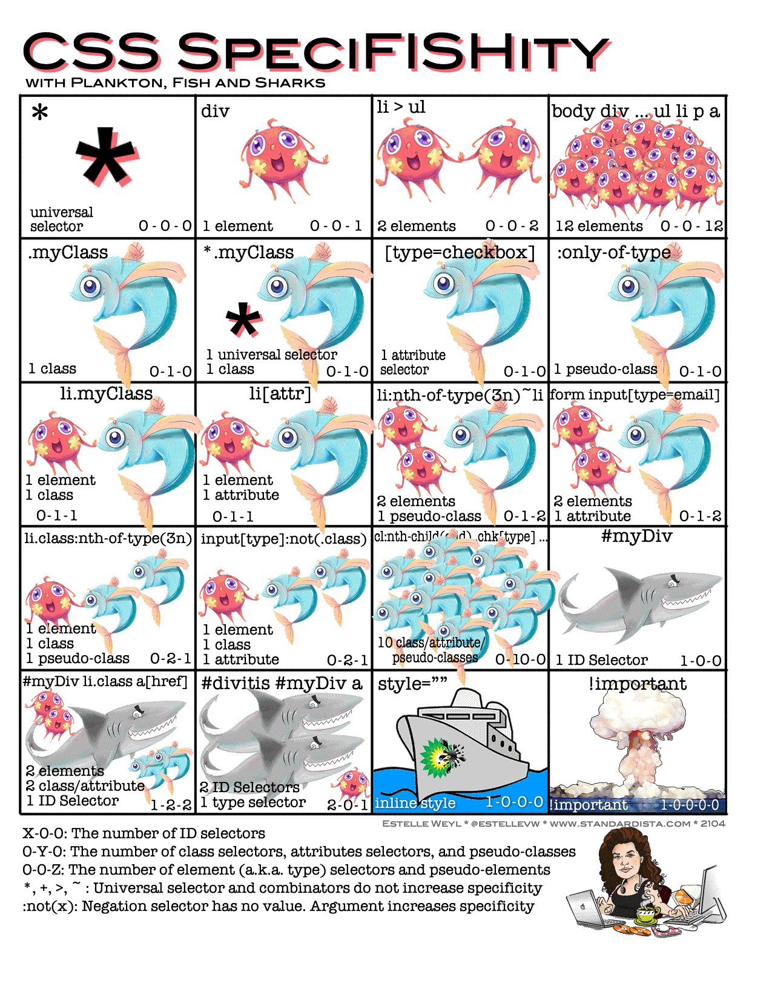

# CSS (cascading style sheet)
: 웹 페이지의 **디자인**과 **레이아웃**을 구성하는 언어
```
# 선언

선택자 {
  속성: 값;
}
```

- root (기본 글자사이즈): 16px
- rem(기본 글자사이즈의 배수)
    - 1 rem: 16 px
    - 2 rem: 32 px
- semicolon ; 필수 

## 적용 방법
1. Inline style
2. Internal style
3. **external style**
```
외부 스타일을 자주 사용하며 인라인 스타일은 가독성이 떨어지므로 test용도로 사용되어진다
```
### inline
: `Html` 요소 안에 `style` 속성 값으로 작성
```html
<h1 style="color: blue; background-color: yellow;"> Hello World!</h1>

```
### internal
: `head` 태그 안에 `style`태그를 작성
### external 
: 별도의 css 파일 생성 후 html link 태그를 사용해 불러오기
```html
<head>
  ...
  <link rel="stylesheet" href="style.css">
<title>Document</title>
</head>

```
# CSS Selectors 
: HTML 요소를 선택하여 스타일을 적용할 수 있도록 하는 선택자
## 종류
### 1. 기본 선택자 
- 전체 석택자: "*"
- 요소(tag) 선택자
    - 요소/ element/ tag 같은말
- 클래스(class) 선택자 
    - (.클래스속성값)
- 아이디(id) 선택자 
    - (#아이디속성값)
    - 문서에는 주어진 아이디를 가진 요소가 하나만 있어야 함
- 속성(attr) 선택자 
    - ([속성=값])
### 2. 결합자(combinators)
- 자손 결합자 (""(space))
    - 첫 번째 요소의 자손 요소들 선택
        - **(자식, 손주 포함)** 
- 자식 결합자(">")
    - 첫 번째 요소의 직계 자식만 선택
        - only 자식 
    

## specificity (명시도)
: 결과적으로 요소에 적용할 css 선언을 결정하기 위한 알고리즘
- CSS selector의 서열정리


### cascade (계단식)
: 한 요소에 동일한 가중치를 가진 선택자가 적용될 때 CSS에서 `마지막`에 나오는 선언이 사용됨
```html
h1 {
    color: red;
}
h1 {
    color: purple;
}
```
- 승자는 뒤에나온 purple 이여!
    - purle: "green 너는 내가 먹는다"
    - green: " ㅂㄷㅂㄷ 내가 먼저 나왔는데!!!@#@#"
### 명시도가 높은 순 
1. importance
    - !important
    - 다른 우선순위 규칙보다 우선하여 적용하는 키워드
        - cascade의 구조를 무시하고 강제로 스타일을 적용하는 방식임 -> 사용 권장 X
2. Inline 스타일
3. 선택자
    - id선택자 > class 선택자 > 요소 선택자
4. 소스 코드 선언 순서 
- 같은 태그일때는 명시도 
- 다른 태그일때는 상관 ㄴㄴ


## 상속
: 상속을 통해 부모 요소의 속성을 자식에게 상속해 재사용성을 높임
### 종류
- **상속 O**
    - Text 관련 요소 (font, color, text-align)
    - opacity
    - visibility
- **상속 X**
    - Box model 관련요소 
    - position 관련요소
    