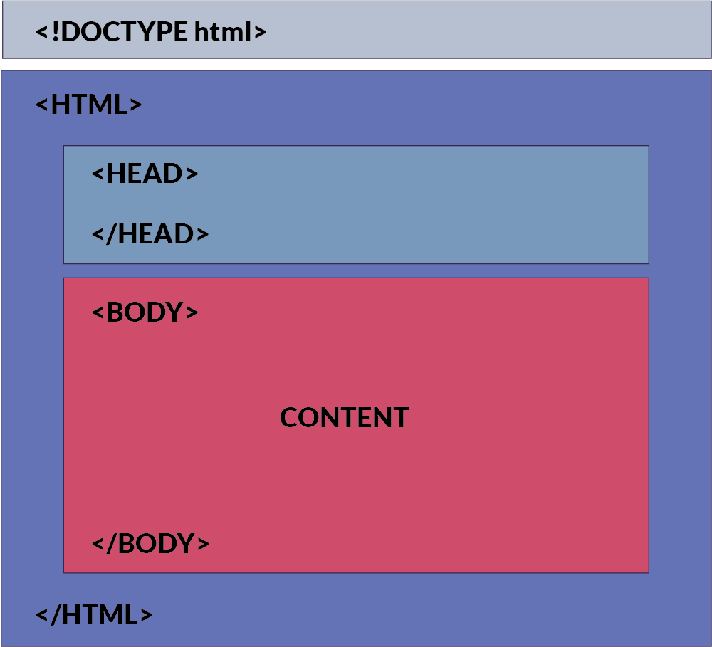

# Web
- World Wide Web
  - 인터넷으로 연결된 컴퓨터들이 정보를 공유하는 거대한 정보 공간
- Web
  - Web site, Web application등을 통해 사용자들이 정보를 검색하고 상호 작용하는 기술 
- Web Site
  - 인터넷에서 여러 개의 `Web page`가 모인 것으로, 사용자들에게 정보나 서비스를 제공하는 공간
- Web Page
  - HTML, CSS 등의 웹 기술을 이용하여 만들어진 **Web site를 구성하는 하나의 요소**
  - 구성요소
    - 구조: HTML 
    - 스타일링: CSS
    - 작동: Javascript


# HTML
: 웹 페이지의 `의미`와 `구조`를 정의하는 언어  
- Hypertext: 웹 페이지를 다른 페이지로 연결하는 링크 
- Markup Language: 태그 등을 이용하여 문서나 데이터의 구조를 명시하는 언어 

## HTML 구조 

- `<!DOCTYPE html>`
  - 해당 문서가 html로 문서라는 것을 나타냄
- `<html></html>`
  - 전체 페이지의 콘텐츠를 포함
- `<title></title>`
  - 브라우저 탭 및 즐겨찾기 시 표시되는 제목으로 사용 
- `<head></head>`
  - HTML 문서에 관련된 설명, 설정
- `<body></body>`
  - 페이지에 표시되는 모든 콘텐츠
## HTML element 
: 하나의 요소는 opening tag와 closing tag
- opening tag <p>
- closing tag </p>
```
닫는 태그가 없는 것도 존재함
```
## attributes
### 규칙
- 속성은 요소 이름과 속성 사이에 `공백`이 있어야 함
- 하나 이상의 속성들이 있는 경우엔 속성 사이에 공백으로 구분

